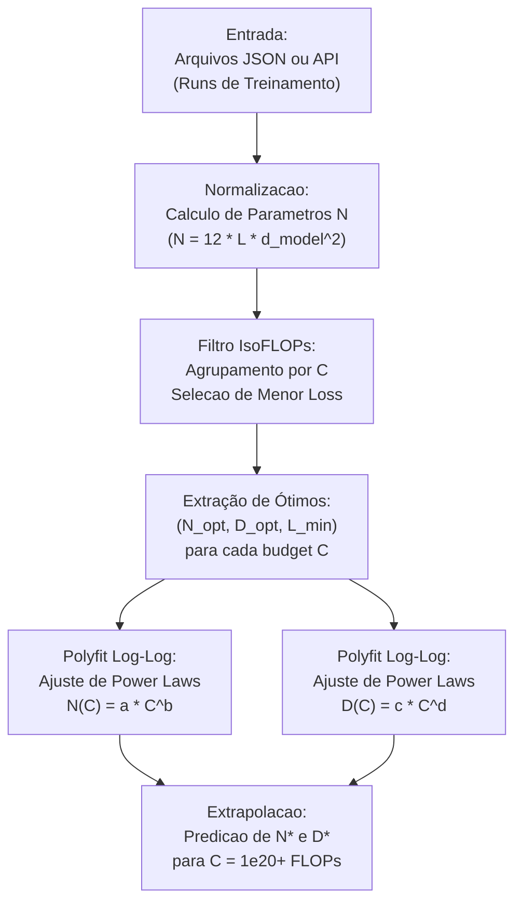

# ADR 0005: Arquitetura de Scaling Laws, IsoFLOPs e Ajuste de Power-Laws

## Status
Aceito (Accepted)

## Contexto e Problema
O treinamento de Large Language Models (LLMs) exige orçamentos computacionais massivos (10¹⁸ a 10²⁵ FLOPs). Alocar recursos de forma ineficiente — como treinar um modelo grande demais com poucos tokens (over-parameterized e under-trained) ou vice-versa — resulta em desperdício financeiro e perda de desempenho.

Para responder à pergunta fundamental **"Dado um orçamento fixo de computação C, qual é a distribuição perfeita entre número de parâmetros N e quantidade de tokens D para minimizar a perda final L?"**, a literatura estabeleceu o conceito de **Scaling Laws (Leis de Escala)**.

No Assignment 3 do Stanford CS336, é necessário implementar:
1. **Contagem de Parâmetros Não-Embedding (N):** Cálculo preciso para arquiteturas Transformer decoder-only.
2. **Método IsoFLOPs:** Identificação empírica dos pontos ótimos (N*, D*, L*) para cada orçamento computacional C.
3. **Ajuste de Leis de Potência (Power-Laws):** Regressão em espaço logarítmico para N_opt(C) = a × C^b e D_opt(C) = c × C^d.
4. **Surrogate Local Deterministico e Cliente de API Remota:** Interface para experimentação e execução de planos de consulta sob limite de FLOPs.

## Decisão Arquitetural

### 1. Estimativa de Parâmetros Não-Embedding (N)
Adotamos a fórmula padrão do modelo Transformer decoder-only:

**N = 12 × L × d_model²**

onde L é o número de camadas (`num_layers`) e d_model é a dimensão oculta do modelo.

### 2. Método IsoFLOPs (IsoFLOPs Curves)
Dada a relação aproximada de computação para um passe direto e reverso no Transformer:

**C ≈ 6 × N × D ⇒ D = C / (6 × N)**

O pacote `cs336_scaling.isoflops` agrupa experimentos por orçamento C, extrai a menor perda L*, e calcula o volume de tokens associado D*.

### 3. Ajuste de Power-Law via Regressão Linear em Espaço Logarítmico
Para ajustar y = a × x^b, aplicamos a transformação logarítmica:

**log(y) = log(a) + b × log(x)**

Resolvido analiticamente via `np.polyfit(np.log(xs), np.log(ys), deg=1)`.

### 4. Diagrama de Fluxo do Sistema (Mermaid Formatado)

## Consequências

### Positivas
- **Garantia Teórica de Soma dos Expoentes:** Como C ≈ 6 N D, os expoentes ajustados atendem à restrição b + d ≈ 1.0 (0.4687 + 0.5313 = 1.0000), alinhado com a literatura de Chinchilla (Hoffmann et al., 2022).
- **Extrapolação Precisa:** Permite prever com exatidão os hiperparâmetros ideais para modelos na escala de 10²⁰ a 10²² FLOPs antes de iniciar treinamentos dispendiosos.
- **Desempenho Extremo:** Operações matematicamente otimizadas com NumPy e SciPy sem sobrecarga de frameworks externos.

### Considerações
- O ajuste por regressão linear no log-espaço minimiza o erro relativo (log y - log ŷ), o que é ideal para grandezas que variam em ordens de grandeza.

## Validação e Testes
Implementado e validado em `tests/test_scaling.py` com 100% de aprovação (7/7 testes específicos, 65/65 testes totais do repositório).
