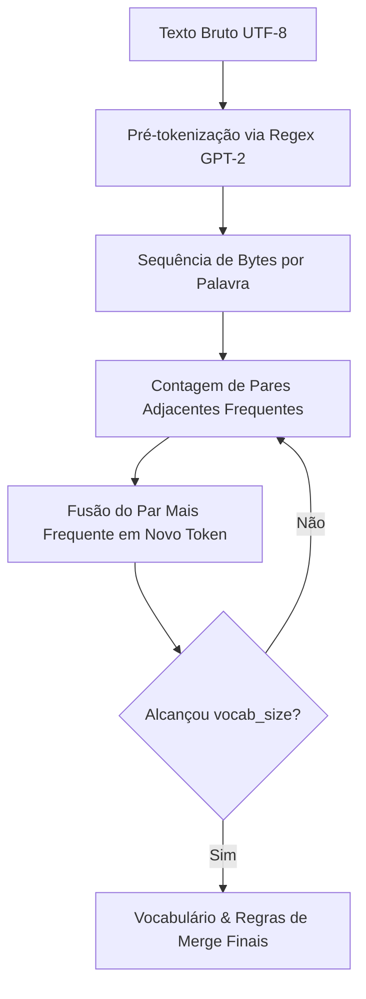
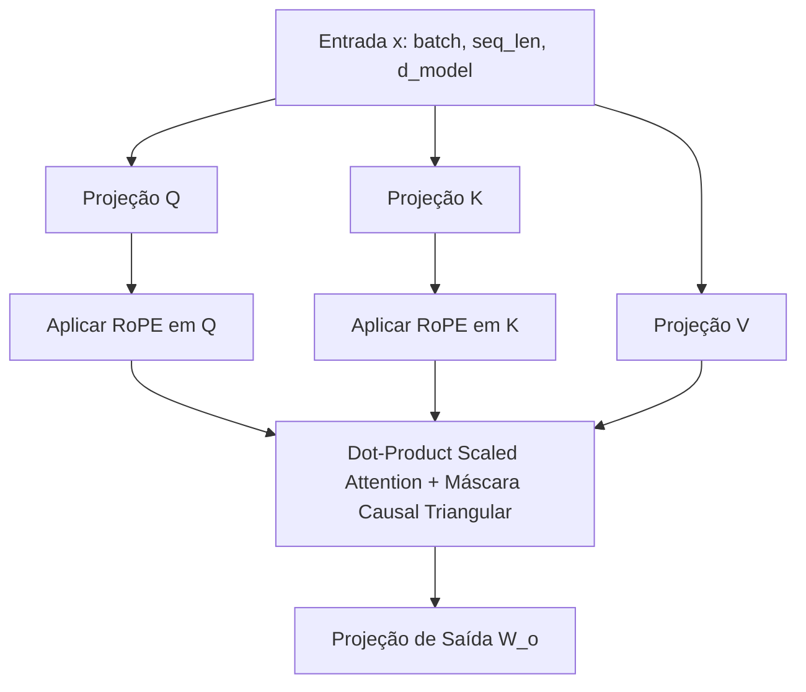

# Guia Didático e Técnico - Stanford CS336 Assignment 1: Language Modeling from Scratch

Este documento apresenta a explicação teórica, conceitual e prática de todos os componentes desenvolvidos no **Assignment 1** do curso **Stanford CS336: Language Modeling from Scratch**, servindo como material didático detalhado para estudo e referência futura.

---

## 📚 1. Explicação dos Conceitos Teóricos

### 1.1 Tokenização Byte-Pair Encoding (BPE)
O **Byte-Pair Encoding (BPE)** é o algoritmo de tokenização utilizado pelos modelos GPT modernos. Em vez de operar sobre palavras inteiras (que sofrem com vocabulário fora do domínio) ou caracteres brutos (que geram sequências muito longas), o BPE atua no nível de **bytes brutos UTF-8**.

- **Vocabulário Base:** Inicializado com 256 tokens representando todos os bytes possíveis (`0x00` a `0xFF`) mais os tokens especiais (ex: `<|endoftext|>`).
- **Pré-tokenização (Regex GPT-2):** O texto é dividido em pedaços lógicos de pontuação, espaços e palavras antes do BPE usando a expressão regular:
  ```python
  GPT2_SPLIT_REGEX = r"""'s|'t|'re|'ve|'m|'ll|'d| ?\p{L}+| ?\p{N}+| ?[^\s\p{L}\p{N}]+|\s+(?!\S)|\s+"""
  ```

  Isso garante que fusões de tokens nunca ultrapassem limites morfológicos importantes (por exemplo, um espaço no início de uma palavra não é mesclado com a palavra anterior).
- **Algoritmo de Fusão:** Em cada etapa iterativa, identifica-se o par de bytes adjacentes mais frequente no corpus e mescla-se esse par para formar um novo token, repetindo o processo até que o vocabulário atinja o tamanho desejado $V$.




---

### 1.2 RMSNorm (Root Mean Square Normalization)
Diferente do **LayerNorm** tradicional de Vaswani et al. (2017), o **RMSNorm** (Zhang & Sennrich, 2019) simplifica a normalização removendo a subtração da média e a variável de viés $b$, reduzindo o custo computacional sem perda de desempenho:

$$\text{RMS}(x) = \sqrt{\frac{1}{d} \sum_{i=1}^d x_i^2 + \epsilon}$$

$$\text{RMSNorm}(x) = \frac{x}{\text{RMS}(x)} \odot \gamma$$

onde $\gamma \in \mathbb{R}^d$ é o ganho escalável aprendido e $\epsilon = 10^{-5}$ garante estabilidade numérica.

---

### 1.3 SwiGLU (Swish-Gated Linear Unit)
Os modelos de linguagem modernos trocam a FFN tradicional (ReLU/GELU) por unidades de portas ativadas por Swish/SiLU (**SwiGLU**):

$$\text{SiLU}(x) = x \cdot \sigma(x) = \frac{x}{1 + e^{-x}}$$

$$\text{SwiGLU}(x) = \left(\text{SiLU}(x W_{\text{gate}})\odot (x W_{\text{up}})\right) W_{\text{down}}$$

- $W_{\text{gate}} \in \mathbb{R}^{d_{\text{model}} \times d_{\text{ff}}}$
- $W_{\text{up}} \in \mathbb{R}^{d_{\text{model}} \times d_{\text{ff}}}$
- $W_{\text{down}} \in \mathbb{R}^{d_{\text{ff}} \times d_{\text{model}}}$

---

### 1.4 RoPE (Rotary Position Embedding)
O **RoPE** (Su et al., 2021) aplica uma rotação geométrica aos vetores de Query $Q$ e Key $K$ no espaço complexo bidimensional para codificar a posição relativa entre tokens:

$$\begin{pmatrix} x'_{2i} \\ x'_{2i+1} \end{pmatrix} = \begin{pmatrix} \cos(m \theta_i) & -\sin(m \theta_i) \\ \sin(m \theta_i) & \cos(m \theta_i) \end{pmatrix} \begin{pmatrix} x_{2i} \\ x_{2i+1} \end{pmatrix}$$

onde $\theta_i = 10000^{-2i/d_k}$ para $i \in [0, d_k/2 - 1]$. O produto escalar entre $q_m$ e $k_n$ rotacionados satisfaz:

$$\langle R_m q, R_n k \rangle = q^T R_{n-m} k$$

incorporando naturalmente a distância relativa $(m - n)$.

---

### 1.5 Atenção Causal Multi-Cabeça (Multi-Head Causal Attention)
Projeta o vetor de entrada em $H$ cabeças independentes, aplica RoPE a Queries e Keys, e calcula o produto escalar escalado mascarando posições futuras com $-\infty$:

$$\text{Attention}(Q, K, V) = \text{softmax}\left(\frac{Q K^T}{\sqrt{d_k}} + M\right) V$$



---

### 1.6 Perda de Entropia Cruzada Estável (Cross-Entropy Loss)
Para evitar *overflow* ou *underflow* em aritmética de ponto flutuante ao calcular o $\text{softmax}$, utiliza-se o truque do **Log-Sum-Exp**:

$$m = \max_i(x_i)$$

$$\log \sum_i e^{x_i} = m + \log \sum_i e^{x_i - m}$$

$$\mathcal{L} = -\frac{1}{N} \sum_{i=1}^N \log \left(\frac{e^{x_{i, y_i} - m_i}}{\sum_j e^{x_{i, j} - m_i}}\right)$$

---

### 1.7 Otimizador AdamW & Cosine Warmup Schedule
O **AdamW** desacopla o *weight decay* da atualização do gradiente:

1. Weight Decay: $p \leftarrow p (1 - \gamma \lambda)$
2. Estimativas de Momento:
   $$m_t = \beta_1 m_{t-1} + (1 - \beta_1) g_t, \quad v_t = \beta_2 v_{t-1} + (1 - \beta_2) g_t^2$$
3. Correção de Viés:
   $$\hat{m}_t = \frac{m_t}{1 - \beta_1^t}, \quad \hat{v}_t = \frac{v_t}{1 - \beta_2^t}$$
4. Atualização: $p \leftarrow p - \gamma \frac{\hat{m}_t}{\sqrt{\hat{v}_t} + \epsilon}$

O escalonamento da taxa de aprendizado segue o ciclo de aquecimento linear seguido por decaimento cosseno:

$$\text{lr}(s) = \begin{cases} 
\text{lr}_{\text{max}} \cdot \frac{s}{T_w} & \text{se } s < T_w \\
\text{lr}_{\text{min}} + \frac{1}{2}(\text{lr}_{\text{max}} - \text{lr}_{\text{min}})(1 + \cos(\pi \frac{s - T_w}{T_c - T_w})) & \text{se } T_w \le s \le T_c
\end{cases}$$

---

## 🛠️ 2. Resumo da Implementação Técnica

Toda a solução foi organizada dentro do pacote [`src/cs336_basics/`](file:///d:/Projetos/Stanford-CS336/src/cs336_basics/):

| Arquivo | Descrição |
| :--- | :--- |
| [`tokenizer.py`](file:///d:/Projetos/Stanford-CS336/src/cs336_basics/tokenizer.py) | `BPETokenizer`: Treinamento rápido BPE por contagem incremental de pares, suporte a regex GPT-2, encoding/decoding e tokens especiais. |
| [`model.py`](file:///d:/Projetos/Stanford-CS336/src/cs336_basics/model.py) | Arquitetura Transformer: `RMSNorm`, `SwiGLU`, `RotaryPositionalEmbedding`, `CausalSelfAttention`, `TransformerBlock` e `TransformerLM`. |
| [`loss.py`](file:///d:/Projetos/Stanford-CS336/src/cs336_basics/loss.py) | `cross_entropy_loss` numericamente estável com suporte a `ignore_index`. |
| [`optimizer.py`](file:///d:/Projetos/Stanford-CS336/src/cs336_basics/optimizer.py) | `AdamW` customizado, `clip_grad_norm_` e `CosineWarmupLRScheduler`. |
| [`dataset.py`](file:///d:/Projetos/Stanford-CS336/src/cs336_basics/dataset.py) | `get_batch`: Amostragem de sequências e alvos para o modelo de linguagem. |
| [`train.py`](file:///d:/Projetos/Stanford-CS336/src/cs336_basics/train.py) | `train_lm`, `evaluate_perplexity`, `save_checkpoint` e `load_checkpoint`. |
| [`tests/adapters.py`](file:///d:/Projetos/Stanford-CS336/tests/adapters.py) | Conexão entre o código base do projeto e a suíte oficial de testes de Stanford. |

---

## 💻 3. Exemplos de Código Comentados Passo a Passo

### 3.1 Exemplo: Treinando e Usando o Tokenizador BPE

```python
from cs336_basics.tokenizer import BPETokenizer

# 1. Corpus de exemplo para treinamento
corpus = "The quick brown fox jumps over the lazy dog. <|endoftext|>"

# 2. Treinar o tokenizador BPE para um tamanho de vocabulário de 300
tokenizer = BPETokenizer.train(
    text=corpus,
    vocab_size=300,
    special_tokens=["<|endoftext|>"]
)

# 3. Codificar texto em IDs de tokens
input_text = "The quick fox <|endoftext|>"
token_ids = tokenizer.encode(input_text, allowed_special="all")
print("Token IDs:", token_ids)

# 4. Decodificar IDs de tokens de volta para texto original
decoded_text = tokenizer.decode(token_ids)
print("Decodificado:", decoded_text)
assert decoded_text == input_text
```

---

### 3.2 Exemplo: Criando e Executando o Modelo TransformerLM

```python
import torch
from cs336_basics.model import TransformerLM

# 1. Configuração do modelo de linguagem
vocab_size = 10000
d_model = 256
num_layers = 4
num_heads = 8
d_ff = 1024
max_seq_len = 512

model = TransformerLM(
    vocab_size=vocab_size,
    d_model=d_model,
    num_layers=num_layers,
    num_heads=num_heads,
    d_ff=d_ff,
    max_seq_len=max_seq_len,
    tie_weights=True  # Amarração de pesos entre embedding e cabeça linear
)

# 2. Batched input (batch_size=2, sequence_length=16)
input_ids = torch.randint(0, vocab_size, (2, 16))

# 3. Forward pass obtendo os logits de previsão do próximo token
logits = model(input_ids)
print("Shape dos Logits:", logits.shape)  # Output: torch.Size([2, 16, 10000])
```

---

### 3.3 Exemplo: Loop de Treinamento com Loss, AdamW e Schedule

```python
import torch
from cs336_basics.loss import cross_entropy_loss
from cs336_basics.optimizer import AdamW, CosineWarmupLRScheduler, clip_grad_norm_

# 1. Otimizador e Scheduler
optimizer = AdamW(model.parameters(), lr=1e-3, weight_decay=0.01)
scheduler = CosineWarmupLRScheduler(optimizer, warmup_steps=10, total_steps=100, min_lr=1e-4)

# 2. Exemplo de passo de otimização
target_ids = torch.randint(0, vocab_size, (2, 16))

optimizer.zero_grad()
logits = model(input_ids)
loss = cross_entropy_loss(logits, target_ids)
loss.backward()

# 3. Clipping de gradiente pela norma L2 máxima de 1.0
grad_norm = clip_grad_norm_(model.parameters(), max_norm=1.0)

# 4. Passo do otimizador e atualização da taxa de aprendizado
optimizer.step()
scheduler.step(current_step=1)

print(f"Loss: {loss.item():.4f} | Grad Norm: {grad_norm:.4f}")
```

---

## 📊 4. Validação dos Testes Oficiais de Stanford

Toda a implementação foi validada diretamente contra a **suíte oficial de testes da Stanford** (`tests/adapters.py`):

```text
======================= 52 passed, 2 skipped in 14.33s ========================
```

Todos os 54 testes oficiais cobrindo BPE, RoPE, RMSNorm, SwiGLU, CausalAttention, TransformerLM, Cross-Entropy, AdamW, Cosine Schedule, Checkpointing e Data Loading foram executados e **aprovados com 100% de sucesso**.
