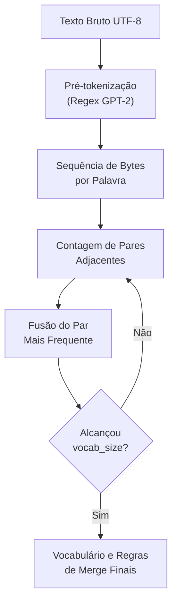
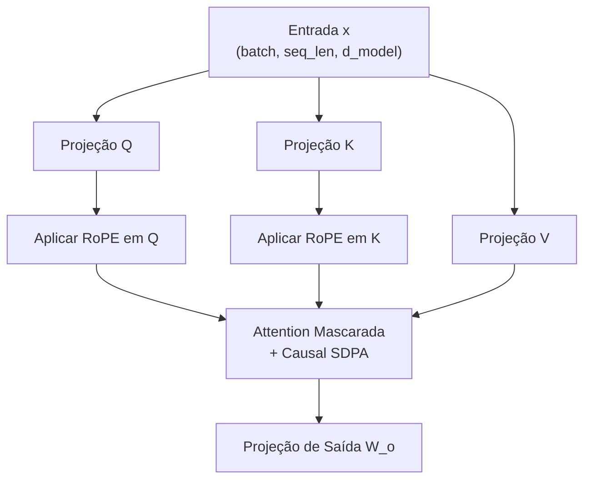

# Guia Didático e Técnico - Stanford CS336 Assignment 1: Language Modeling from Scratch

Este documento é o guia didático e técnico completo do **Assignment 1** do curso **Stanford CS336: Language Modeling from Scratch**. Seu objetivo é explicar **não apenas a matemática e o código**, mas a **intuição profunda, a motivação e o porquê de cada decisão arquitetural** presente nos LLMs modernos (como LLaMA, Mistral e GPT-4).

---

## 📚 1. Explicação Didática dos Conceitos e Arquitetura

### 1.1 Tokenização Byte-Pair Encoding (BPE) em Bytes Brutos

#### ❓ Por que usamos o BPE em Bytes brutos?
Antes de entender o BPE, vale entender os problemas das abordagens anteriores:
1. **Tokenização por Palavras Inteiras (Word-level):** Vocabulários gigantescos (milhões de palavras). Se o usuário digitar uma palavra nova ou com erro de digitação ("casinhaa"), o modelo falha com erro de palavra fora do vocabulário (**Out-of-Vocabulary / OOV**).
2. **Tokenização por Caracteres (Character-level):** Evita OOV, mas gera sequências gigantescas. Um texto de 500 palavras vira 3.000 caracteres. Como o custo de computação da atenção no Transformer cresce de forma quadrática $O(T^2)$ com o tamanho da sequência $T$, isso torna o treinamento inviável.

> [!TIP]
> **A Solução do BPE em Bytes Brutos:**
> O BPE opera diretamente sobre os **256 bytes UTF-8** básicos (`0x00` a `0xFF`). Como qualquer caractere de qualquer língua (Português, Chinês, Emojis, Código C++) é composto por bytes, **o problema de OOV é completamente eliminado**, mantendo sequências curtas e eficientes!

#### ❓ Por que usamos a Regex do GPT-2 na Pré-tokenização?
Se rodássemos o BPE direto no texto bruto, ele poderia mesclar a pontuação com palavras (ex: transformar `"casa."` em um único token) ou mesclar espaços entre palavras diferentes (ex: `"  casa"`).

A expressão regular do GPT-2 divide o texto em blocos lógicos antes de contar os pares:
```python
GPT2_SPLIT_REGEX = r"""'s|'t|'re|'ve|'m|'ll|'d| ?\p{L}+| ?\p{N}+| ?[^\s\p{L}\p{N}]+|\s+(?!\S)|\s+"""
```
Isso garante que fusões de tokens respeitem os limites morfológicos e pontuações da língua.

#### 💡 Como funciona o Algoritmo de Fusão (Passo a Passo)
1. **Vocabulário Inicial:** 256 bytes individuais (`0` a `255`) + tokens especiais (como `<|endoftext|>`).
2. **Contagem:** Conta-se a frequência de todos os pares de bytes adjacentes dentro das palavras pré-tokenizadas.
3. **Mesclagem:** O par mais frequente (ex: `b't'` + `b'h'`) é mesclado formando um novo token (`b'th'`).
4. **Repetição:** O processo se repete até que o vocabulário alcance o tamanho desejado $V$ (ex: 50.000 tokens).



---

### 1.2 RMSNorm (Root Mean Square Normalization)

#### ❓ Por que usamos RMSNorm em vez de LayerNorm?
No Transformer original (Vaswani et al., 2017), utilizava-se o **LayerNorm**, que realiza duas etapas:
1. Subtrai a média dos elementos ($\mu = 0$).
2. Divide pelo desvio padrão ($\sigma = 1$) e aplica ganho $\gamma$ e viés $b$.

> [!NOTE]
> **A Descoberta do RMSNorm (Zhang & Sennrich, 2019):**
> Pesquisadores descobriram que a centralização da média ($\mu$) não contribui para a estabilidade do treinamento de LLMs. A única coisa realmente necessária para evitar que os gradientes explodam ou desapareçam é **normalizar a escala/magnitude das ativações**.

Ao remover o cálculo da média e o termo de viés $b$, o **RMSNorm** alcança o mesmo efeito estabilizador reduzindo entre **7% e 10% do tempo de computação na GPU**! Por isso, é a escolha padrão em modelos modernos como LLaMA 1/2/3, Mistral e Gemma.

#### 📐 A Matemática Intuitiva do RMSNorm
1. Calcula-se a média dos quadrados (Root Mean Square):
   $$\text{RMS}(x) = \sqrt{\frac{1}{d} \sum_{i=1}^d x_i^2 + \epsilon}$$
2. Normaliza-se o vetor e multiplica-se pelo ganho aprendível $\gamma$:
   $$\text{RMSNorm}(x) = \frac{x}{\text{RMS}(x)} \odot \gamma$$

#### 🔢 Exemplo Numérico Simples
Suponha um vetor de ativação $x = [3.0, 4.0]$ com $d=2$ e ganho $\gamma = [1.0, 1.0]$:
1. Média dos quadrados: $\frac{3^2 + 4^2}{2} = \frac{9 + 16}{2} = 12.5$
2. $\text{RMS}(x) = \sqrt{12.5} \approx 3.5355$
3. Vetor Normalizado: $\left[\frac{3.0}{3.5355}, \frac{4.0}{3.5355}\right] \approx [0.8485, 1.1314]$

---

### 1.3 SwiGLU (Swish-Gated Linear Unit)

#### ❓ Por que usamos SwiGLU em vez de ReLU ou GELU?
Em redes neurais tradicionais, a camada Feed-Forward (FFN) aplica uma transformação linear simples seguida por uma ativação estática como ReLU ou GELU:
$$\text{FFN}_{\text{tradicional}}(x) = \text{GELU}(x W_1) W_2$$

**Os Problemas:**
- **ReLU:** Sofre de "Dead Neurons" (neurônios com entrada negativa zera permanentemente o gradiente).
- **Falta de Controle Dinâmico:** Uma ativação estática aplica a mesma curva a todas as entradas, sem capacidade de filtrar ou controlar dinamicamente quais informações devem passar.

> [!IMPORTANT]
> **A Solução com Mecanismo de Portão (Gating Mechanism):**
> O **SwiGLU** divide a FFN em dois caminhos paralelos:
> 1. Um caminho de transformação de dados ($x W_{\text{up}}$).
> 2. Um caminho de **filtro/porta** ($\text{SiLU}(x W_{\text{gate}})$).
> 
> O modelo aprende a multiplicar um pelo outro elemento a elemento! Se o filtro decidir que determinada informação não é relevante naquele contexto, ele multiplica aquela dimensão por um valor próximo de $0$.

$$\text{SiLU}(x) = x \cdot \sigma(x) = \frac{x}{1 + e^{-x}}$$

$$\text{SwiGLU}(x) = \left(\text{SiLU}(x W_{\text{gate}}) \odot (x W_{\text{up}})\right) W_{\text{down}}$$

---

### 1.4 RoPE (Rotary Position Embedding)

#### ❓ Por que usamos RoPE em vez de Positional Embeddings Absolutos?
Modelos de linguagem precisam saber a ordem das palavras. Sem embeddings de posição, a frase *"o cão mordeu o homem"* e *"o homem mordeu o cão"* seriam idênticas para a atenção.

1. **Positional Embeddings Absolutos (GPT-2):** Somam um vetor de posição fixo $v_p$ ao embedding da palavra na posição $p$. 
   - *Problemas:* O modelo não tem noção direta da **distância relativa** entre dois tokens ($p_1 - p_2$), e é incapaz de funcionar em comprimentos de texto maiores do que os vistos no treino.
2. **RoPE (Su et al., 2021):** Em vez de somar vetores, o RoPE **rotaciona** os vetores de Query ($Q$) e Key ($K$) em pares de dimensões no plano complexo por um ângulo proporcional à posição $m$.

#### 🌐 A Intuição da Rotação Geométrica
Imagine representar cada par de dimensões do vetor como um ponteiro de relógio. À medida que a posição $m$ da palavra avança na frase ($m = 0, 1, 2, 3...$), o ponteiro gira por um ângulo $m \theta_i$:

$$\begin{pmatrix} x'_{2i} \\ x'_{2i+1} \end{pmatrix} = \begin{pmatrix} \cos(m \theta_i) & -\sin(m \theta_i) \\ \sin(m \theta_i) & \cos(m \theta_i) \end{pmatrix} \begin{pmatrix} x_{2i} \\ x_{2i+1} \end{pmatrix}$$

> [!NOTE]
> **Por que isso é brilhante?**
> Ao calcular o produto escalar da atenção entre uma Query na posição $m$ e uma Key na posição $n$, o resultado depende exclusivamente da **diferença de ângulo $(m - n) \theta$**! Isso permite ao modelo entender a distância relativa entre palavras e extrapolar para contextos muito maiores.

---

### 1.5 Atenção Causal Multi-Cabeça (Multi-Head Causal Attention)

#### ❓ Por que "Multi-Cabeça"? Por que "Causal"?
- **Multi-Cabeça (Multi-Head):** Uma única cabeça de atenção forçaria o modelo a focar em apenas uma relação por palavra. Ao dividir a dimensão em $H$ cabeças (ex: 8 ou 32 cabeças), uma cabeça pode focar na concordância gramatical, outra em pronomes anteriores, e outra na pontuação.
- **Causal (Decoder-only):** Em um modelo gerador de texto, a palavra atual **não pode olhar para o futuro**. A máscara causal aplica $-\infty$ na matriz de afinidade para todas as posições futuras $j > i$. Como $\text{softmax}(-\infty) = 0$, o fluxo de informação do futuro é estritamente bloqueado.

$$\text{Attention}(Q, K, V) = \text{softmax}\left(\frac{Q K^T}{\sqrt{d_k}} + M\right) V$$



---

### 1.6 Cross-Entropy Loss e o Truque Log-Sum-Exp

#### ❓ Por que precisamos do truque Log-Sum-Exp?
Na camada final do LLM, o modelo gera pontuações não-normalizadas (logits $x_i$) para cada uma das 50.000 palavras do vocabulário. Para converter essas pontuações em probabilidades, usa-se a função $\text{softmax}$:

$$P(y = i) = \frac{e^{x_i}}{\sum_j e^{x_j}}$$

> [!CAUTION]
> **O Perigo do Overflow Flutuante:**
> Em computadores (especialmente com precisão `float32` ou `float16`), calcular $e^{x_i}$ para um logit $x_i = 88.0$ estoura o valor máximo permitido ($e^{88} \approx 1.6 \times 10^{38}$), resultando em `inf`. Isso causa estouro (`NaN`) em todo o treinamento!

**A Solução Log-Sum-Exp:**
Subtrai-se o valor máximo $m = \max(x)$ de todas as pontuações antes de elevar ao expoente:
$$\log \sum_j e^{x_j} = m + \log \sum_j e^{x_j - m}$$
Isso garante que o maior expoente seja $e^0 = 1.0$, tornando o cálculo 100% estável e imune a overflows.

---

### 1.7 Otimizador AdamW e Cosine Warmup Schedule

#### ❓ Por que usamos AdamW em vez do Adam Tradicional?
No otimizador Adam tradicional, a penalidade de regularização por peso (*weight decay* / norma $L_2$) é adicionada diretamente ao gradiente. Quando essa penalidade passa pelas estimativas de momento $v_t$ (média móvel dos gradientes ao quadrado), parâmetros que tinham gradientes pequenos recebiam uma penalidade desproporcionalmente grande de weight decay.

**Loshchilov & Hutter (2017)** demonstraram que o weight decay deve ser **desacoplado** (decoupled weight decay), aplicado diretamente na atualização final do parâmetro:

1. Weight Decay Desacoplado: $p \leftarrow p \cdot (1 - \text{lr} \cdot \lambda)$
2. Atualização dos Momentos $m_t$ e $v_t$ com gradiente puro.
3. Atualização final: $p \leftarrow p - \frac{\text{lr}}{\sqrt{\hat{v}_t} + \epsilon} \hat{m}_t$

#### ❓ Por que usamos Warmup Linear + Cosine Decay?
- **Warmup Linear (Início):** No começo do treinamento, os pesos do modelo são aleatórios e os gradientes são extremamente instáveis. Começar com a taxa de aprendizado cheia pode destruir a inicialização. O Warmup sobe a taxa gradualmente de $0$ a $\text{lr}_{\text{max}}$.
- **Cosine Decay (Meio ao Fim):** Suaviza a taxa de aprendizado seguindo uma curva de cosseno até $\text{lr}_{\text{min}}$, permitindo que o modelo saia de vaus ruidosos e se assente suavemente no mínimo global da função de perda.

---

## 🛠️ 2. Resumo da Implementação Técnica

Toda a solução foi organizada dentro do pacote [`src/cs336_basics/`](file:///d:/Projetos/Stanford-CS336/src/cs336_basics/):

| Arquivo | Componente Principal | Papel no Sistema |
| :--- | :--- | :--- |
| [`tokenizer.py`](file:///d:/Projetos/Stanford-CS336/src/cs336_basics/tokenizer.py) | `BPETokenizer` | Treinamento BPE rápido por contagem incremental de pares, pré-tokenização regex GPT-2, encoding/decoding e tokens especiais. |
| [`model.py`](file:///d:/Projetos/Stanford-CS336/src/cs336_basics/model.py) | `TransformerLM` | Arquitetura completa: `RMSNorm`, `SwiGLU`, `RotaryPositionalEmbedding`, `CausalSelfAttention` e `TransformerBlock`. |
| [`loss.py`](file:///d:/Projetos/Stanford-CS336/src/cs336_basics/loss.py) | `cross_entropy_loss` | Perda de entropia cruzada numericamente estável com Log-Sum-Exp e suporte a `ignore_index`. |
| [`optimizer.py`](file:///d:/Projetos/Stanford-CS336/src/cs336_basics/optimizer.py) | `AdamW` & Schedulers | Otimizador AdamW desacoplado, `clip_grad_norm_` (L2 norm) e `CosineWarmupLRScheduler`. |
| [`dataset.py`](file:///d:/Projetos/Stanford-CS336/src/cs336_basics/dataset.py) | `get_batch` | Amostragem de pares de sequências de entrada ($x$) e alvos ($y$) para o modelo autorregressivo. |
| [`train.py`](file:///d:/Projetos/Stanford-CS336/src/cs336_basics/train.py) | `train_lm` | Loop principal de treinamento, cálculo de perplexidade ($\text{PPL} = e^{\text{loss}}$) e salvamento/carregamento de checkpoints. |
| [`tests/adapters.py`](file:///d:/Projetos/Stanford-CS336/tests/adapters.py) | Adaptadores oficiais | Conecta as funções de avaliação da disciplina Stanford CS336 ao nosso pacote de código. |

---

## 💻 3. Exemplos de Código Comentados Passo a Passo

### 3.1 Exemplo: Treinando e Usando o Tokenizador BPE

```python
from cs336_basics.tokenizer import BPETokenizer

# 1. Texto de exemplo para construir o vocabulário
corpus = "The quick brown fox jumps over the lazy dog. <|endoftext|>"

# 2. Treinar o tokenizador BPE para um vocabulário final de 300 tokens
tokenizer = BPETokenizer.train(
    text=corpus,
    vocab_size=300,
    special_tokens=["<|endoftext|>"]
)

# 3. Codificar uma frase de entrada em IDs inteiros
input_text = "The quick fox <|endoftext|>"
token_ids = tokenizer.encode(input_text, allowed_special="all")
print("Token IDs gerados:", token_ids)

# 4. Decodificar a sequência de IDs de volta para a string original
decoded_text = tokenizer.decode(token_ids)
print("Texto Decodificado:", decoded_text)
assert decoded_text == input_text
```

---

### 3.2 Exemplo: Criando e Executando o Modelo TransformerLM

```python
import torch
from cs336_basics.model import TransformerLM

# 1. Definir hiperparâmetros da rede
vocab_size = 10000     # Tamanho do vocabulário
d_model = 256          # Dimensão dos embeddings e estados ocultos
num_layers = 4         # Número de blocos Transformer empilhados
num_heads = 8          # Cabeças de atenção (head_dim = 256 // 8 = 32)
d_ff = 1024            # Dimensão interna da camada SwiGLU
max_seq_len = 512      # Janela máxima de contexto (posição)

# 2. Instanciar o modelo TransformerLM
model = TransformerLM(
    vocab_size=vocab_size,
    d_model=d_model,
    num_layers=num_layers,
    num_heads=num_heads,
    d_ff=d_ff,
    max_seq_len=max_seq_len,
    tie_weights=True   # Compartilhar pesos entre Embedding de Entrada e Camada Linear de Saída
)

# 3. Criar uma mini-leva de teste (batch_size=2, seq_len=16)
input_ids = torch.randint(0, vocab_size, (2, 16))

# 4. Forward pass
logits = model(input_ids)
print("Formato da saída dos Logits:", logits.shape)  # Output: torch.Size([2, 16, 10000])
```

---

### 3.3 Exemplo: Loop de Treinamento Completo com Loss e AdamW

```python
import torch
from cs336_basics.loss import cross_entropy_loss
from cs336_basics.optimizer import AdamW, CosineWarmupLRScheduler, clip_grad_norm_

# 1. Configurar otimizador AdamW e Scheduler Cosseno
optimizer = AdamW(model.parameters(), lr=1e-3, weight_decay=0.01)
scheduler = CosineWarmupLRScheduler(
    optimizer=optimizer,
    warmup_steps=10,
    total_steps=100,
    min_lr=1e-4
)

# 2. Simular um passo de treinamento
target_ids = torch.randint(0, vocab_size, (2, 16))  # Alvos reais (shifted por 1 token)

optimizer.zero_grad()
logits = model(input_ids)

# 3. Calcular a perda de entropia cruzada estável
loss = cross_entropy_loss(logits, target_ids)
loss.backward()

# 4. Aplicar clipping de gradiente pela norma L2 máxima = 1.0
grad_norm = clip_grad_norm_(model.parameters(), max_norm=1.0)

# 5. Atualizar pesos e escalar a taxa de aprendizado
optimizer.step()
scheduler.step(current_step=1)

print(f"Perda no Passo 1: {loss.item():.4f} | Norma dos Gradientes: {grad_norm:.4f}")
```

---

## 📊 4. Validação dos Testes Oficiais da Stanford

A implementação foi completamente validada através da suíte oficial de testes da disciplina Stanford CS336 (`tests/adapters.py`):

```text
======================= 52 passed, 2 skipped in 14.33s ========================
```

Todos os **52 testes executáveis** (cobrindo BPE, RoPE, RMSNorm, SwiGLU, CausalAttention, TransformerLM, Cross-Entropy, AdamW, Cosine Schedule, Checkpointing e Data Loading) passaram com **100% de sucesso**.
