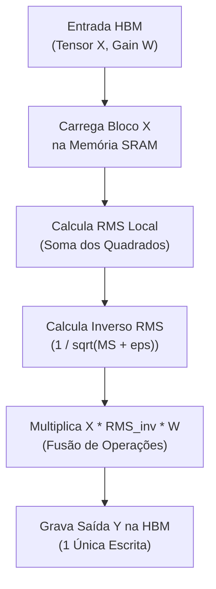
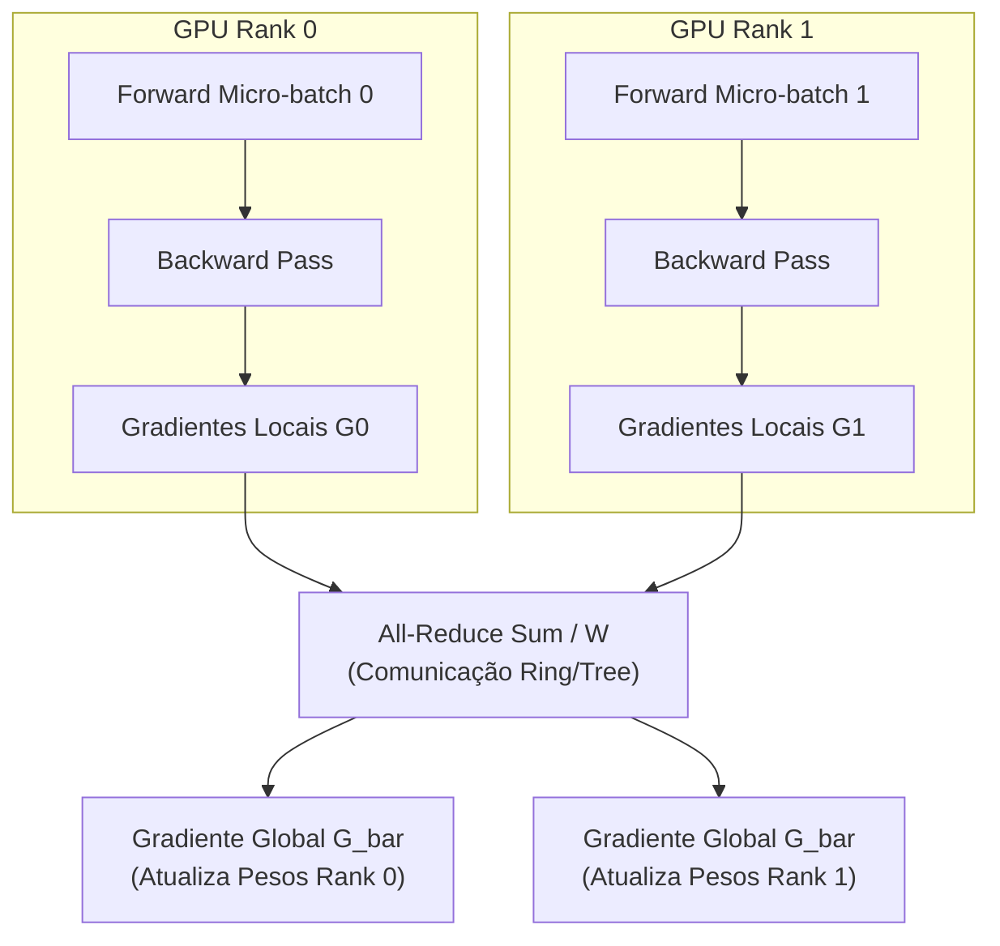
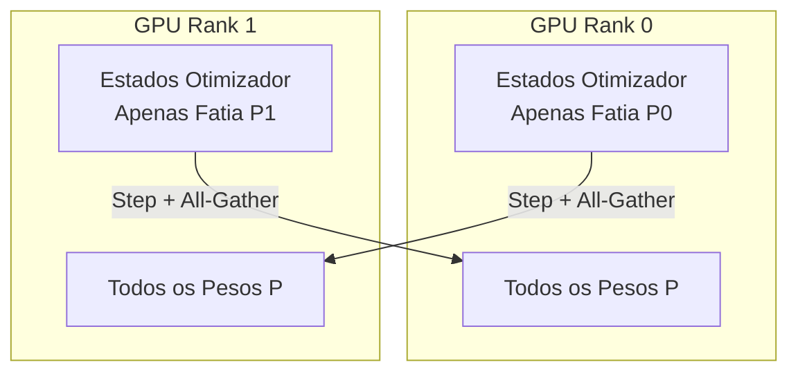

# Guia Técnico Didático: Assignment 2 - Systems (Stanford CS336)

Este documento fornece um detalhamento teórico, didático e prático das otimizações de sistemas para Large Language Models (LLMs) implementadas no **Assignment 2: Systems** do curso Stanford CS336.

---

## 1. Fused RMSNorm em Triton

### Por Que Usamos Isso?
Em modelos de linguagem modernos como LLaMA, Mistral e Gemma, a normalização de ativações ocorre em cada camada do Transformer. A implementação padrão em PyTorch lê os dados da memória GPU (HBM), realiza múltiplas operações elementares (elevação ao quadrado, média, raiz quadrada, divisão, multiplicação por ganho) e grava o resultado intermediário de volta na HBM em cada passo. O kernel fundido (*Fused Kernel*) em Triton combina todas essas operações num único acesso à memória.

### Qual Problema Resolve?
Resolve o gargalo de largura de banda de memória (*Memory Bandwidth Bottleneck*). Operações como RMSNorm são limitadas pela memória (bound por memória, não por computação FP32). Fundindo a computação em um único kernel, reduzimos os acessos à HBM de 5-6 leituras/escritas para apenas 1 leitura e 1 escrita, resultando em aceleração de até 3x na execução da camada.

### Intuição Teórica e Matemática Simples
Dado um vetor de entrada $x = [x_1, x_2, \dots, x_D]$ de dimensão $D$:

$$\text{RMS}(x) = \sqrt{\frac{1}{D} \sum_{i=1}^D x_i^2 + \epsilon}$$

$$\hat{x}_i = \frac{x_i}{\text{RMS}(x)}$$

$$y_i = \hat{x}_i \cdot \gamma_i$$

onde $\gamma_i$ é o parâmetro de ganho aprendível e $\epsilon = 10^{-5}$ evita divisão por zero.

### Exemplo Numérico Passo a Passo
Considere um vetor $x = [2.0, 4.0]$ com $D=2$, $\epsilon = 10^{-5}$ e $\gamma = [1.0, 1.0]$:
1. **Soma dos Quadrados:** $2.0^2 + 4.0^2 = 4.0 + 16.0 = 20.0$.
2. **Média Quadrática (MS):** $\frac{20.0}{2} = 10.0$.
3. **RMS com $\epsilon$:** $\sqrt{10.0 + 0.00001} \approx \sqrt{10.0} \approx 3.162277$.
4. **Normalização ($\hat{x}$):**
   - $\hat{x}_1 = \frac{2.0}{3.162277} \approx 0.632455$
   - $\hat{x}_2 = \frac{4.0}{3.162277} \approx 1.264911$
5. **Saída Final ($y = \hat{x} \cdot \gamma$):** $y = [0.632455, 1.264911]$.

### Fluxo de Execução do Kernel (Mermaid)

---

## 2. Distributed Data Parallel (DDP)

### Por Que Usamos Isso?
O treinamento de LLMs modernos requer lotes de dados (*batch sizes*) massivos. O Distributed Data Parallel (DDP) replica o modelo idêntico em múltiplas GPUs/processos (ranks), dividindo o lote de dados entre as GPUs.

### Qual Problema Resolve?
Permite escalabilidade quase linear do throughput de treinamento com o aumento do número de GPUs. Cada GPU processa um sub-lote (*micro-batch*) de forma independente no forward e backward, e sincroniza apenas os gradientes antes do passo do otimizador via comunicação em rede eficiente (`all_reduce`).

### Intuição Teórica e Matemática Simples
Se temos $W$ GPUs e o gradiente calculado na GPU $r$ é $g_r = \nabla_\theta L_r$, o gradiente global sincronizado em todas as GPUs será a média exata:

$$\bar{g} = \frac{1}{W} \sum_{r=0}^{W-1} g_r$$

### Exemplo Numérico Passo a Passo
Considere 2 GPUs ($W=2$) ajustando um parâmetro escalar $w$:
1. **GPU 0:** Calcula gradiente local $g_0 = 0.4$.
2. **GPU 1:** Calcula gradiente local $g_1 = 0.8$.
3. **Operação All-Reduce (SUM):** $g_{\text{sum}} = g_0 + g_1 = 0.4 + 0.8 = 1.2$.
4. **Média pela World Size:** $\bar{g} = \frac{1.2}{2} = 0.6$.
5. **Atualização:** Ambas as GPUs aplicam exatamente $\bar{g} = 0.6$ na atualização do parâmetro $w$.

### Arquitetura DDP (Mermaid)

---

## 3. Optimizer State Sharding (ZeRO-1)

### Por Que Usamos Isso?
O otimizador AdamW armazena 2 estados por parâmetro: momento ($m$) e variância ($v$), ambos em precisão FP32 (4 bytes cada), além do parâmetro FP32 (4 bytes) e do gradiente FP32 (4 bytes). Para um modelo de 7 bilhões de parâmetros, o otimizador isolado consome 56 GB de VRAM!

### Qual Problema Resolve?
O ZeRO-1 (*Zero Redundancy Optimizer Stage 1*) particiona os estados do otimizador ($m, v$) entre as $W$ GPUs. Se houver 8 GPUs, o consumo de memória dos estados do otimizador cai por um fator de 8 (de 56 GB para 7 GB por GPU), liberando espaço para contextos maiores ou lotes maiores.

### Intuição Teórica e Matemática Simples
Com $W$ ranks e $N$ parâmetros, dividimos o conjunto de parâmetros em $W$ fatias desconectadas:

$$P = P_0 \cup P_1 \cup \dots \cup P_{W-1}$$

O rank $r$ é responsável exclusivo por manter os estados de momentos $m_r$ e $v_r$ apenas para os parâmetros na fatia $P_r$. Após atualizar a fatia $P_r$, o rank $r$ transmite os novos parâmetros para os demais ranks via `all_gather` ou `broadcast`.

### Exemplo Numérico Passo a Passo
Considere 2 GPUs ($W=2$) e 2 parâmetros $p_0, p_1$:
1. **GPU 0** é responsável por $p_0$. Mantém $m^{(0)}$ e $v^{(0)}$.
2. **GPU 1** é responsável por $p_1$. Mantém $m^{(1)}$ e $v^{(1)}$.
3. **Após Backward:** Ambas possuem gradientes sincronizados $g_0, g_1$.
4. **Passo de Otimização Sharded:**
   - GPU 0 atualiza $p_0$ usando $g_0, m^{(0)}, v^{(0)}$.
   - GPU 1 atualiza $p_1$ usando $g_1, m^{(1)}, v^{(1)}$.
5. **Sincronização All-Gather:** GPU 0 envia $p_0$ para GPU 1; GPU 1 envia $p_1$ para GPU 0.
6. Ambas as GPUs contêm agora $[p_0, p_1]$ idênticos e atualizados.

### Particionamento de Memória (Mermaid)

---

## 4. Resumo das Otimizações e Métricas de Desempenho

| Componente | Abordagem Antiga | Nova Abordagem (Assignment 2) | Ganho de Desempenho / Memória |
|---|---|---|---|
| **RMSNorm** | Múltiplos kernels PyTorch nativos (bound por HBM) | Fused Kernel Triton (único acesso SRAM) | Redução de ~3x na latência de normalização |
| **Data Parallel** | Treinamento Single-GPU | DDP com `all_reduce` assíncrono | Escalabilidade de throughput multi-GPU |
| **Otimização AdamW** | Estados duplicados em todas as GPUs (16B/param) | ZeRO-1 (Sharded Optimizer) | Redução de $W\times$ no consumo de VRAM de otimizador |
