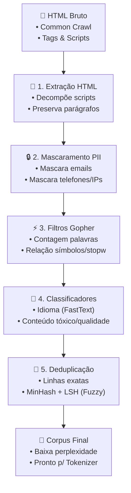
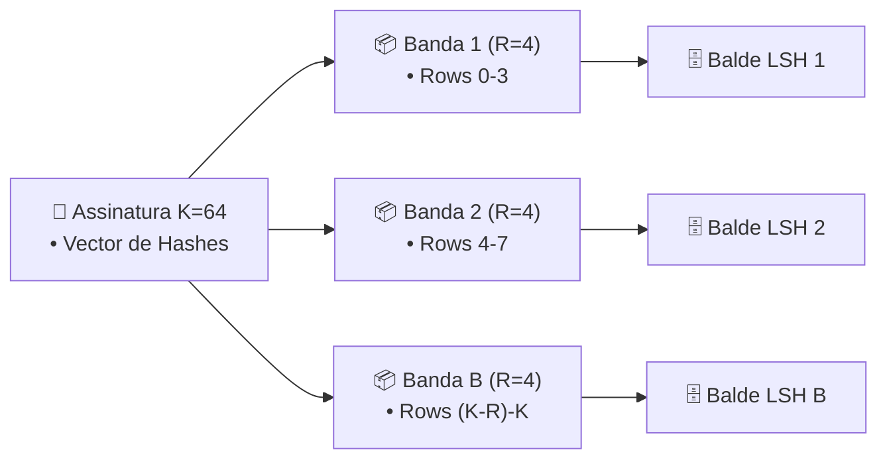

# Guia Didático e Arquitetura - Assignment 4: Pipeline de Processamento e Curadoria de Dados para Pré-treinamento de LLMs

Este documento apresenta a arquitetura, motivações teóricas, formulações matemáticas e guia prático de implementação do **Assignment 4 (Curadoria e Processamento de Dados de Pré-treinamento)** do curso Stanford CS336.

---

## 1. Visão Geral da Arquitetura do Pipeline

O pipeline de dados transforma raspagens brutas da web (ex: arquivos WARC/HTML do Common Crawl) em um corpus limpo, seguro, sem duplicatas e filtrado por qualidade para pré-treinamento de modelos de linguagem.



---

## 2. Componentes do Pipeline: "Por que usamo isso?" & "Qual problema resolve?"

### Componente 1: Extração de Texto de HTML (`cs336_data.extraction`)
- **Por que usamos isso?**
  A web é escrita em HTML contendo tags de estilização, scripts JavaScript, menus de navegação, rodapés e anúncios que não possuem conteúdo semântico relevante para o aprendizado de linguagem natural.
- **Qual problema resolve?**
  Evita que o modelo decore sintaxe de layout web (`<div class="...">`, `var x = 10;`) em vez de aprender estrutura textual e conhecimento do mundo.

### Componente 2: Mascaramento de PII (`cs336_data.pii`)
- **Por que usamos isso?**
  Páginas web frequentemente expõem Informações Pessoais Identificáveis (PII), como e-mails privados, números de telefone e endereços IP.
- **Qual problema resolve?**
  Impede a memorização e o vazamento acidental de dados privados de usuários durante a geração de texto da LLM (cumprindo regulamentações como LGPD/GDPR).

### Componente 3: Filtros de Qualidade Heurísticos Gopher (`cs336_data.quality_filters`)
- **Por que usamos isso?**
  Baseado no trabalho da DeepMind (Rae et al., 2021 - Gopher), aplica regras heurísticas leves para eliminar documentos spammados ou de baixíssima qualidade antes de gastar recursos de classificação pesados.
- **Qual problema resolve?**
  Elimina documentos muito curtos, listas exageradas de marcadores (bullet points), sequências puras de caracteres especiais (`# % & *`) e textos sem palavras de parada básicas da língua inglesa.

### Componente 4: Classificação de Idioma e Toxicidade (`cs336_data.classifiers`)
- **Por que usamos isso?**
  Modelos de linguagem monolíngues requerem filtragem estrita de idioma. Além disso, remover conteúdo altamente tóxico ou discurso de ódio melhora o alinhamento baseline do modelo.
- **Qual problema resolve?**
  Filtra documentos em idiomas indesejados e reduz viés nocivo antes da etapa de fine-tuning / RLHF.

### Componente 5: Deduplicação Exata e MinHash + LSH (`cs336_data.deduplication`)
- **Por que usamos isso?**
  Páginas web possuem réplicas idênticas ou ligeiramente modificadas (espelhos de sites, artigos reeditados, avisos de copyright).
- **Qual problema resolve?**
  A deduplicação economiza até 30% a 50% de FLOPS de treinamento, reduz a memorização de trechos e evita sobre-ajuste (overfitting).

---

## 3. Matemática e Intuição Teórica de MinHash + LSH

### Intuição da Similaridade de Jaccard
Para dois documentos $A$ e $B$ representados pelos seus conjuntos de $k$-shingles (sub-sequências de $k$ palavras) $S_A$ e $S_B$:

$$
J(S_A, S_B) = \frac{|S_A \cap S_B|}{|S_A \cup S_B|}
$$

Comparações diretas de conjuntos de shingles para bilhões de documentos exigem tempo $\mathcal{O}(N^2)$, o que é computacionalmente inviável.

### MinHash (Minimization Hashing)
Utilizamos $K$ funções de hash permutadas independentes $h_i(x) = (a_i \cdot x + b_i) \pmod p$.
Para cada função de hash $h_i$, a probabilidade de que os dois valores mínimos colidam é exatamente igual à Similaridade de Jaccard:

$$
\mathbb{P}\left(\min_{s \in S_A} h_i(s) = \min_{s \in S_B} h_i(s)\right) = J(S_A, S_B)
$$

### LSH (Locality-Sensitive Hashing) por Bandas
Dividimos a assinatura de MinHash de tamanho $K$ em $B$ bandas contendo $R$ linhas cada ($K = B \times R$).
A probabilidade de dois documentos compartilharem pelo menos um balde LSH é:

$$
P_{\text{colisão}} = 1 - (1 - s^R)^B
$$

onde $s = J(S_A, S_B)$ é a similaridade real de Jaccard.



---

## 4. Exemplo Numérico Passo a Passo

### Passo 1: Shingling ($k=3$ palavras)
- **Doc A**: `"o gato preto pulou o muro"`
  - Shingles A: `{"o gato preto", "gato preto pulou", "preto pulou o", "pulou o muro"}`
- **Doc B**: `"o gato preto saltou o muro"`
  - Shingles B: `{"o gato preto", "gato preto saltou", "preto saltou o", "saltou o muro"}`

### Passo 2: União e Interseção
- Interseção: `{"o gato preto"}` (tamanho 1)
- União: 7 shingles únicos
- Jaccard Real: $J(A, B) = \frac{1}{7} \approx 0.1428$

### Passo 3: Assinatura de MinHash e LSH
Suponha $K=4$ hashes com $B=2$ bandas e $R=2$ linhas.
Se a similaridade fosse $s=0.8$:
- Probabilidade de colisão LSH: $1 - (1 - 0.8^2)^2 = 1 - (1 - 0.64)^2 = 1 - 0.1296 = 0.8704$ (87.04% de chance de identificar o par candidato para verificação exata).

---

## 5. Exemplo de Código Comentado

```python
from cs336_data.extraction import extract_text_from_html
from cs336_data.pii import mask_emails, mask_ip_addresses
from cs336_data.quality_filters import gopher_quality_filter
from cs336_data.deduplication import MinHashLSH

# 1. Extração de HTML
html_raw = "<html><body><h1>Notícia</h1><p>Contato: admin@empresa.com.br</p></body></html>"
text_clean = extract_text_from_html(html_raw)

# 2. Mascaramento PII
text_masked, email_count = mask_emails(text_clean)
text_masked, ip_count = mask_ip_addresses(text_masked)

# 3. Filtro de Qualidade Gopher
if gopher_quality_filter(text_masked, min_words=5):
    print("Documento aprovado no filtro de qualidade Gopher!")

# 4. Deduplicação Fuzzy com MinHash LSH
lsh = MinHashLSH(num_hashes=64, num_bands=16, shingle_size=5)
corpus_deduped = lsh.deduplicate_dataset([text_masked], similarity_threshold=0.7)
```

---

## 6. Resumo dos Testes e Validação

O suite de testes em `tests/test_cs336_data/` valida todos os módulos:
- `test_extraction.py`: Remoção de tags `<script>` e `<style>`, e decodificação segura de bytes.
- `test_pii.py`: Mascaramento correto de e-mails, telefones e IPs.
- `test_quality_filters.py`: Aprovação de artigos legítimos e rejeição de spams ou textos com muitos símbolos.
- `test_classifiers.py`: Predição de idioma e score de toxicidade.
- `test_deduplication.py`: Assinaturas MinHash, colisão LSH e remoção de cópias semelhantes.
