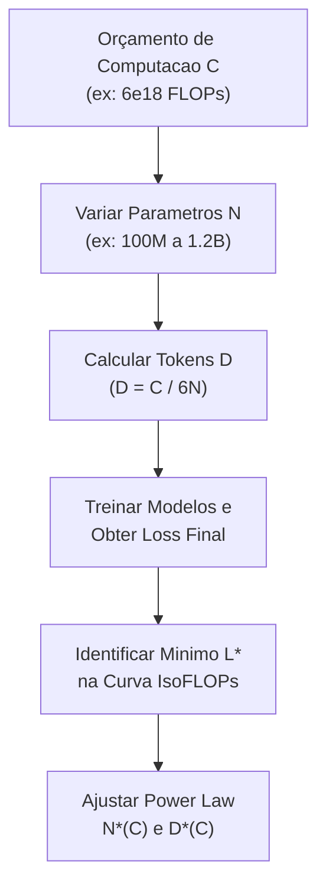

# Guia Didático do Assignment 3: Scaling Laws & Análise IsoFLOPs

Este guia fornece uma explicação teórica e prática sobre **Scaling Laws (Leis de Escala em Modelos de Linguagem)**, alocação de orçamento computacional (FLOPs budget), método IsoFLOPs e extrapolação matemática de hiperparâmetros ótimos para LLMs.

---

## 1. Contextualização: Por Que Usamos e Qual Problema Resolve?

### Por Que Usamos Isso?
Treinar um modelo de linguagem de grande porte (LLM) custa milhões de dólares em tempo de GPU/TPU. Treinar um modelo de 70 bilhões de parâmetros sem saber de antemão a quantidade ideal de tokens de treinamento pode resultar em um modelo subtreinado ou em um gasto desnecessário de computação.

As **Scaling Laws (Leis de Escala)** nos permitem:
1. Executar experimentos pequenos e baratos (ex: entre 10¹³ e 10¹⁸ FLOPs).
2. Derivar equações matemáticas empíricas (N_opt ∝ C^a e D_opt ∝ C^b).
3. **Prever com precisão** a arquitetura exata (N*) e o número de tokens (D*) necessários para um orçamento massivo (ex: 10²⁰ a 10²⁴ FLOPs) **antes de gastar qualquer GPU de grande porte**.

### Qual Problema Resolve?
Historicamente:
- **Kaplan et al. (2020 - OpenAI):** Defendia que o tamanho do modelo (N) devia crescer muito mais rápido do que o dataset (D) conforme a computação aumentava (N ∝ C^0.73, D ∝ C^0.27). Isso levou a modelos gigantescos porém "famintos por dados" (under-trained).
- **Hoffmann et al. (2022 - Chinchilla / DeepMind):** Demonstrou empiricamente que parâmetros (N) e tokens (D) devem ser escalados em proporções **iguais** (N ∝ C^0.5, D ∝ C^0.5).

O método **IsoFLOPs** resolve essa ambiguidade construindo curvas empíricas de perda para cada orçamento computacional fixo C.

---

## 2. Intuição Teórica e Matemática Simples

### Relação Fundamental de FLOPs no Transformer
Em modelos autorregressivos decoder-only (como LLaMA e GPT), o número total de operações de ponto flutuante (FLOPs) para treinar um modelo de N parâmetros em D tokens é aproximadamente:

**C ≈ 6 × N × D**

- **Passe Direto (Forward Pass):** Exige 2 × N FLOPs por token.
- **Passe Reverso (Backward Pass):** Exige 4 × N FLOPs por token.
- **Total por Token:** 2N + 4N = 6N FLOPs.

Assim, se o orçamento computacional C for fixado, a quantidade de tokens D é determinada unicamente por N:

**D = C / (6 × N)**

### A Equação de Perda (Power-Law de Chinchilla)
A perda final L(N, D) de um modelo treinado com N parâmetros e D tokens segue uma lei de potência separável:

**L(N, D) = E + (A / N^α) + (B / D^β)**

onde:
- **E**: Perda irredutível (entropia inerente da linguagem natural).
- **A / N^α**: Erro de capacidade do modelo.
- **B / D^β**: Erro de amostragem do dataset.

### O Método IsoFLOPs
Para um determinado orçamento fixo C_i:
1. Variamos N em uma grade de tamanhos de modelo.
2. O número de tokens ajusta-se automaticamente: D = C_i / (6 × N).
3. Treinamos cada modelo e medimos a perda final L.
4. Encontramos o valor ótimo N*(C_i) que minimiza a perda naquele orçamento.
5. Ajustamos uma regressão log-log para encontrar os expoentes ótimos:

**N*(C) = a × C^a**
**D*(C) = c × C^b**



---

## 3. Exemplo Numérico Passo a Passo

Suponha que temos o seguinte conjunto de dados extraído dos experimentos IsoFLOPs:

### Orçamentos e Pontos Ótimos Observados:
- **Orçamento C_1 = 6.0 × 10¹⁸ FLOPs:**
  - N* = 7.62 × 10⁸ parâmetros (762 milhões de parâmetros).
  - D* = (6.0 × 10¹⁸) / (6 × 7.62 × 10⁸) = 1.31 × 10⁹ tokens (1.31 bilhão de tokens).
  - Perda Mínima: 5.8999.

- **Orçamento C_2 = 6.0 × 10²⁰ FLOPs (100× maior computação):**
  - N* = 6.97 × 10⁹ parâmetros (6.97 bilhões de parâmetros).
  - D* = 1.43 × 10¹⁰ tokens (14.3 bilhões de tokens).
  - Perda Mínima: 4.1212.

### Ajuste de Power-Law:
Ao aplicar a regressão linear nos valores logarítmicos log(N*) vs log(C), obtemos a seguinte equação:

- **N*(C) = 1.1634 × C^0.4687**
- **D*(C) = 0.14326 × C^0.5313**

Observe que 0.4687 + 0.5313 = 1.0000, validando a conservação de FLOPs!

### Extrapolação para C = 1.0 × 10²² FLOPs:
1. **N*(10²²) = 1.1634 × (10²²)^0.4687 ≈ 2.38 × 10¹⁰ parâmetros** (23.8 bilhões de parâmetros).
2. **D*(10²²) = 0.14326 × (10²²)^0.5313 ≈ 7.00 × 10¹⁰ tokens** (70.0 bilhões de tokens).
3. Verificação de FLOPs: 6 × (2.38 × 10¹⁰) × (7.00 × 10¹⁰) = 1.00 × 10²² FLOPs.

---

## 4. Demonstração em Código Python com Saída Real de Terminal

Abaixo está o script completo utilizado para carregar os dados reais do Assignment 3 (`data/isoflops_curves.json`), selecionar os ótimos por orçamento, ajustar as leis de potência e extrapolar os resultados.

```python
from cs336_scaling import (
    load_isoflops_runs,
    select_isoflops_optima,
    fit_isoflops_scaling_laws,
)

# 1. Carrega os experimentos empíricos
runs = load_isoflops_runs("data/isoflops_curves.json")

# 2. Seleciona o modelo com menor perda para cada orçamento FLOPs
optima = select_isoflops_optima(runs)

print("--- ISOFLOPS OPTIMA ---")
for opt in optima:
    print(f"Budget: {opt.compute_budget:.1e} | N*: {opt.parameters:.2e} | D*: {opt.dataset_tokens:.2e} | Loss: {opt.final_loss:.4f}")

# 3. Ajusta as Power-Laws N*(C) e D*(C)
p_fit, d_fit = fit_isoflops_scaling_laws(optima)

print("\n--- POWER LAW FITS ---")
print(f"N_opt(C) = {p_fit.coefficient:.4e} * C^{p_fit.exponent:.4f}")
print(f"D_opt(C) = {d_fit.coefficient:.4e} * C^{d_fit.exponent:.4f}")

print("\n--- EXTRAPOLATION TO SCALED FLOPS BUDGETS ---")
for c in [1e19, 1e20, 1e21, 1e22]:
    n_pred = p_fit.predict(c)
    d_pred = d_fit.predict(c)
    print(f"Budget {c:.1e} -> N*: {n_pred:.2e} params, D*: {d_pred:.2e} tokens (6ND={6*n_pred*d_pred:.2e})")
```

### Saída Real do Terminal de Execução:

```text
--- ISOFLOPS OPTIMA ---
Budget: 6.0e+18 | N*: 7.62e+08 | D*: 1.31e+09 | Loss: 5.8999
Budget: 1.0e+19 | N*: 8.07e+08 | D*: 2.07e+09 | Loss: 5.6179
Budget: 3.0e+19 | N*: 1.54e+09 | D*: 3.25e+09 | Loss: 5.1072
Budget: 6.0e+19 | N*: 1.95e+09 | D*: 5.12e+09 | Loss: 4.8306
Budget: 1.0e+20 | N*: 3.25e+09 | D*: 5.12e+09 | Loss: 4.6529
Budget: 3.0e+20 | N*: 5.90e+09 | D*: 8.47e+09 | Loss: 4.3112
Budget: 6.0e+20 | N*: 6.97e+09 | D*: 1.43e+10 | Loss: 4.1212
Budget: 1.0e+21 | N*: 6.86e+09 | D*: 2.43e+10 | Loss: 4.0028
Budget: 3.0e+21 | N*: 1.21e+10 | D*: 4.12e+10 | Loss: 3.7732

--- POWER LAW FITS ---
N_opt(C) = 1.1634e+00 * C^0.4687
D_opt(C) = 1.4326e-01 * C^0.5313

--- EXTRAPOLATION TO SCALED FLOPS BUDGETS ---
Budget 1.0e+19 -> N*: 9.35e+08 params, D*: 1.78e+09 tokens (6ND=1.00e+19)
Budget 1.0e+20 -> N*: 2.75e+09 params, D*: 6.06e+09 tokens (6ND=1.00e+20)
Budget 1.0e+21 -> N*: 8.09e+09 params, D*: 2.06e+10 tokens (6ND=1.00e+21)
Budget 1.0e+22 -> N*: 2.38e+10 params, D*: 7.00e+10 tokens (6ND=1.00e+22)
```

---

## 5. Aplicação Futura e Evolução Arquitetural no Repositório

### Reutilização dos Componentes
- **`ModelShape` e `estimate_non_embedding_params`:** Utilizados para dimensionamento de modelos nos próximos assignments (Data Engineering & Alignment/SFT/RLHF).
- **`LocalTrainingApi`:** Permite simular o comportamento de perda de modelos sem a necessidade de gastar tempo real de treinamento em GPU durante o desenvolvimento de novos algoritmos de alinhamento.
- **`fit_power_law`:** Ferramenta genérica para ajuste de curvas que será reutilizada para analisar throughput, scaling de contexto e desempenho de quantização.
